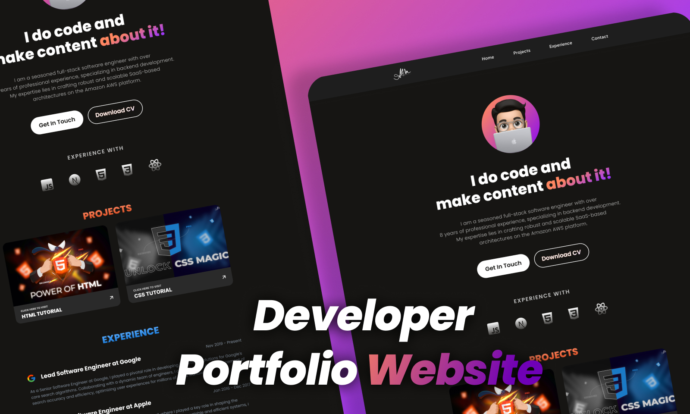

# Developer Portfolio Website

## Introduction

Welcome to my open-source Developer Portfolio website! This project is built using HTML and CSS.

## Sections

1. **About Section:** Discover more about me and my journey in the tech world.

2. **Programming Languages:** Explore some of the languages that programmers use.

3. **Projects Section:** Check out the projects I've worked on.

4. **Experience Section:** Learn about my professional experiences.

5. **Contact Section:** Reach out to me if you have any inquiries.

## Links

- [Figma Design](https://www.figma.com/community/file/1308487677104759760)
- [YouTube Tutorial](https://youtu.be/rkR2Jvh-GZE)

## How to Use

1. Clone the repository: `git clone https://github.com/your-username/your-portfolio.git`
2. Open `index.html` in your preferred browser.

## Learn How to Build

If you want to learn how I created this portfolio, check out my [YouTube tutorial](link-to-youtube-tutorial).

## Subscribe and Star

If you find the content helpful, consider subscribing to my channel for more tutorials. Don't forget to give this repository a star if you love it!

## Connect with Me

- Youtube: [@abmcode](https://www.youtube.com/channel/UC_cVNH4pTyn2p514P0h-MTw)
- Instagram: [@abmcode](https://www.instagram.com/abmcode)
- X: [@abmcode](https://twitter.com/abmcode)

Feel free to explore, contribute, and customize this portfolio for your own use!

Happy coding! 🚀
